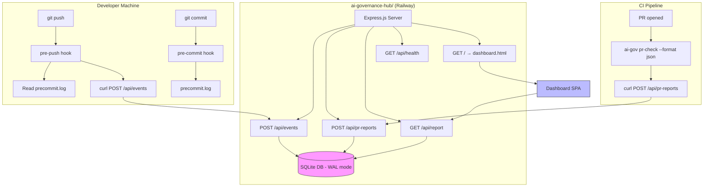
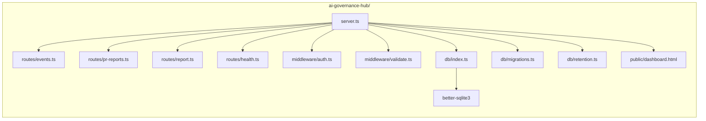

# Design Document: Governance Dashboard

## Overview

The Governance Dashboard feature delivers centralized compliance visibility across all projects using the `ai-gov` CLI. It consists of two major deliverables:

1. **Hub Server** (`ai-governance-hub/`): A standalone Express.js application with a SQLite database (via `better-sqlite3`) that receives governance events from developer machines and CI pipelines, stores them, and serves aggregated compliance reports through a REST API. It also serves a self-contained HTML dashboard.

2. **CLI Modifications** (`ai-governance/`): Extensions to the existing CLI that generate a pre-push hook for silent telemetry reporting, modify the pre-commit hook to write local pass/fail logs, update CI templates with hub-reporting steps, and provide a shared hub configuration utility.

The system prioritizes privacy (developer emails are SHA-256 hashed, no source code is transmitted), reliability (hooks never block developer workflows), and operational simplicity (single SQLite file, single HTML dashboard, Railway-deployable).

## Architecture



### Deployment Topology

- **Hub Server**: Deployed to Railway as a single container. Persistent volume mounted for SQLite database file. Listens on `PORT` (default 3000). Requires `AI_GOV_SECRET` environment variable for production authentication.
- **CLI**: Published to npm as `ai-gov`. Generates hook scripts and CI templates that report to the hub.
- **Dashboard**: Served as a static HTML file by the hub server at the root path `/`.

### Technology Choices

| Component | Technology | Rationale |
|-----------|-----------|-----------|
| Hub Server | Express.js + TypeScript | Matches existing CLI stack, lightweight |
| Database | SQLite + better-sqlite3 | Zero-config, single-file persistence, synchronous API for simplicity |
| Security | helmet, express-rate-limit | Industry-standard Express middleware |
| Compression | compression | Reduces bandwidth for dashboard and API responses |
| Dashboard | Single HTML + Chart.js (CDN) | Zero build step, self-contained, easy to serve |
| Hashing | Node.js crypto (server), sha256sum/shasum (hooks) | Platform-native, no dependencies |

## Components and Interfaces

### Hub Server Components (`ai-governance-hub/`)



#### `server.ts` — Application Entry Point

```typescript
// Responsibilities:
// - Load environment variables (PORT, DB_PATH, AI_GOV_SECRET, NODE_ENV)
// - If AI_GOV_SECRET not set AND NODE_ENV != 'development': exit with error
// - If AI_GOV_SECRET not set AND NODE_ENV == 'development': warn, run in open mode
// - Initialize database with migrations
// - Configure middleware (helmet, compression, rate-limit, JSON parsing)
// - Mount routes
// - Start HTTP server
// - Handle SIGTERM/SIGINT for graceful shutdown
// - Schedule 24-hour retention cleanup

export function createApp(db: Database): Express;
export function startServer(): void;
```

#### `routes/events.ts` — Event Ingestion

```typescript
interface EventPayload {
  project: string;        // 1-100 chars
  team?: string;          // defaults to "ungrouped"
  platform?: string;      // defaults to "unknown"
  developer_hash: string; // exactly 64 lowercase hex chars
  hook_version?: string;
  commit_count?: number;
  compliance_pct?: number; // 0.0 - 100.0
  bypass?: boolean;
  violations?: string[];  // max 50 items, each max 256 chars
  branch?: string;
  push_ts?: number;       // Unix timestamp
  dedup_key?: string;     // 64 hex chars
  ai_usage?: {
    ai_assisted: boolean;
    ai_assisted_count: number;
    commands_used: string[];    // e.g. ["new-feature", "fix"]
    ai_platform: string;       // "claude-code" | "kiro" | "mixed" | "manual"
    active_hooks_count: number;
  };
}

interface EventResponse {
  id: number;
  received_at: string; // ISO 8601
}

// POST /api/events
// Auth: Bearer token required (unless dev mode)
// Returns: 201 (created), 200 (deduplicated), 400/401/413/415/503
```

#### `routes/pr-reports.ts` — PR Report Ingestion

```typescript
interface PRReportPayload {
  project: string;           // required
  developer_hash: string;    // required, 64 hex chars
  team?: string;             // defaults to "ungrouped"
  platform?: string;         // "github"|"gitlab"|"bitbucket"|"unknown", defaults to "unknown"
  compliance_pct?: number;   // 0.0 - 100.0
  violations?: string[];     // max 50 items, each max 256 chars
  pr_number?: number;
  base_branch?: string;
  result?: string;           // "pass"|"fail"|"warn"
}

// POST /api/pr-reports
// Auth: Bearer token required
// Returns: 201 (created), 400/401/503
```

#### `routes/report.ts` — Aggregated Report

```typescript
interface ReportResponse {
  period: string;
  generated_at: string;
  projects: ProjectScore[];
  teams: TeamScore[];
  developers: DeveloperActivity[];
  violations: ViolationTrend[];
  alerts: Alert[];
  ai_usage: AIUsageReport;
}

interface AIUsageReport {
  total_ai_commits: number;
  ai_adoption_pct: number;
  commands_distribution: Record<string, number>;  // command_name → count
  platform_distribution: Record<string, number>;  // platform_name → count
  teams: AIUsageTeam[];
  trend: "up" | "down" | "stable";
  compliance_comparison: {
    ai_pass_rate: number | null;     // % of AI-assisted commits that passed pre-commit; null if no AI entries
    manual_pass_rate: number | null; // % of manual commits that passed pre-commit; null if no manual entries
  };
}

interface AIUsageTeam {
  team: string;
  ai_adoption_pct: number;
  top_command: string;
  trend: "up" | "down" | "stable";
}

interface ProjectScore {
  project: string;
  compliance_pct: number;
  hook_health_pct: number;
  score: number;           // round(compliance_pct * 0.6 + hook_health_pct * 0.4)
  status: "healthy" | "review" | "needs_attention";
  event_count: number;
  last_event_at: string;
}

interface TeamScore {
  team: string;
  score: number;
  status: "healthy" | "review" | "needs_attention";
  project_count: number;
  developer_count: number;
}

interface DeveloperActivity {
  developer_hash: string;
  team: string;
  project_count: number;
  commit_count: number;
  compliance_pct: number;
  bypass_count: number;
  last_active: string;          // ISO 8601
  ai_adoption_pct: number;      // % of commits that are AI-assisted
  primary_ai_platform: string;  // "claude-code" | "kiro" | "mixed" | "manual"
}

interface ViolationTrend {
  type: string;
  count: number;
  trend: "up" | "down" | "stable";
}

interface Alert {
  severity: "critical" | "warning" | "info";
  message: string;
  project: string;
  developer_hash?: string;
}

// GET /api/report?period=7d|30d|90d|all
// No auth required (read endpoint)
// Returns: 200, 400 (invalid period)
```

#### `middleware/auth.ts` — Bearer Token Authentication

```typescript
// Uses crypto.timingSafeEqual for constant-time comparison
// If AI_GOV_SECRET is not set AND NODE_ENV=development: allows all requests (dev mode), logs warning
// If AI_GOV_SECRET is not set AND NODE_ENV!=development: server refuses to start (handled in server.ts)
// Applied to POST routes only
export function authMiddleware(req: Request, res: Response, next: NextFunction): void;
```

#### `middleware/validate.ts` — Input Validation & Sanitization

```typescript
// Validates required fields, format constraints, length limits
// Sanitizes strings: strip HTML tags, remove null bytes, trim whitespace
export function validateEvent(req: Request, res: Response, next: NextFunction): void;
export function validatePRReport(req: Request, res: Response, next: NextFunction): void;
export function sanitizeString(input: string): string;
```

#### `db/index.ts` — Database Connection

```typescript
// Opens SQLite at DB_PATH (default ./data.db)
// Enables WAL journal mode, synchronous=NORMAL, foreign_keys=ON
// All operations use prepared statements
export function openDatabase(dbPath: string): Database;
export function closeDatabase(db: Database): void;
```

#### `db/migrations.ts` — Schema Migrations

```typescript
// Idempotent: uses CREATE TABLE IF NOT EXISTS
// Called at startup before accepting requests
export function runMigrations(db: Database): void;
```

#### `db/retention.ts` — Data Retention

```typescript
// Deletes records older than 90 days from events and pr_reports
// Runs at startup and every 24 hours via setInterval
export function runRetention(db: Database): void;
export function scheduleRetention(db: Database): NodeJS.Timeout;
```

### CLI Components (`ai-governance/`)

#### `src/generators/git-hooks/pre-push.ts` — Pre-Push Hook Generator

```typescript
// Generates a bash script that:
// 1. Checks AI_GOV_TELEMETRY != "off"
// 2. Reads .ai-gov/config.json for hub URL, project, team, platform
// 3. Validates hub URL is HTTPS (skips if not)
// 4. Hashes developer email with SHA-256
// 5. Calculates compliance_pct from last 20 precommit.log entries
// 6. Extracts AI usage data from precommit.log (platform, commands, counts)
// 7. Counts active hooks in .claude/hooks/ and .kiro/hooks/ directories
// 8. Processes refs from stdin (skips deletes, handles new branches)
// 9. Computes dedup_key
// 10. Sends payload (including ai_usage object) via background curl
// 11. Always exits 0

export function generatePrePush(hookVersion: string): string;
```

#### `src/generators/git-hooks/pre-commit.ts` — Modified Pre-Commit (Log Writing)

```typescript
// Existing function modified to append logging logic:
// - After all checks complete, before exit statements
// - mkdir -p .ai-gov/usage-logs/ || true
// - Detect AI platform: check for .claude/ session files or kiro markers
// - Detect AI command: parse from commit context or session metadata
// - Append "<timestamp>|pass|<platform>|<command>" to precommit.log
// - platform: "claude-code", "kiro", or "manual"
// - command: AI command name or empty for manual
// - Rotate if > 500 entries (tail -500 to temp, mv temp to log)
// - All operations suffixed with || true

export function generatePreCommit(): string; // existing signature unchanged
```

#### `src/generators/ci/github.ts` — GitHub Actions Hub Reporting

```typescript
// Modified to conditionally add hub reporting step:
// - Accepts optional hubUrl parameter
// - Only includes hub reporting step when hubUrl is provided
// - Uses ${{ secrets.AI_GOV_SECRET }} for auth
// - Computes developer_hash from ${{ github.actor }}
// - Sends pr-check JSON to hub via curl || true

export function generateGithubCI(options?: { hubUrl?: string }): string;
```

#### `src/generators/ci/gitlab.ts` — GitLab CI Hub Reporting

```typescript
// Modified to conditionally add hub reporting step:
// - Accepts optional hubUrl parameter
// - Only includes hub reporting step when hubUrl is provided
// - Uses $AI_GOV_SECRET for auth
// - Computes developer_hash from $GITLAB_USER_LOGIN
// - Sends pr-check JSON to hub via curl || true

export function generateGitlabCI(options?: { hubUrl?: string; existingContent?: string }): string;
```

#### `src/generators/ci/bitbucket.ts` — Bitbucket Pipelines Hub Reporting

```typescript
// Modified to conditionally add hub reporting step:
// - Accepts optional hubUrl parameter
// - Only includes hub reporting step when hubUrl is provided
// - Uses $AI_GOV_SECRET for auth
// - Computes developer_hash from $BITBUCKET_PR_AUTHOR + "bitbucket"
// - Sends pr-check JSON to hub via curl || true

export function generateBitbucketCI(options?: { hubUrl?: string }): string;
```

#### `src/utils/hub-config.ts` — Hub Configuration Reader

```typescript
export interface HubConfig {
  hub: string;       // Hub server URL
  project: string;   // Project name
  team: string;      // Team name
  platform: string;  // Platform identifier
}

// Reads <projectDir>/.ai-gov/config.json
// Returns HubConfig with defaults for missing fields, or null if file is invalid/missing
export function readHubConfig(projectDir: string): HubConfig | null;
```

#### `src/cli.ts` — CLI Updates

```typescript
// Modified init command to:
// 1. After governance generation, check for hub config via readHubConfig()
// 2. If hub config exists, display transparency disclosure
// 3. Append .ai-gov/usage-logs/ to .gitignore if not present
```

## Data Models

### SQLite Schema

```sql
-- Events table: stores push telemetry from developer machines
CREATE TABLE IF NOT EXISTS events (
  id INTEGER PRIMARY KEY AUTOINCREMENT,
  project TEXT NOT NULL,
  team TEXT NOT NULL DEFAULT 'ungrouped',
  platform TEXT NOT NULL DEFAULT 'unknown',
  developer_hash TEXT NOT NULL,
  hook_version TEXT,
  commit_count INTEGER DEFAULT 0,
  compliance_pct REAL DEFAULT 100.0,
  bypass INTEGER DEFAULT 0,
  violations TEXT DEFAULT '[]',       -- JSON array of strings
  branch TEXT DEFAULT '',
  push_ts INTEGER,                    -- Unix timestamp from client
  dedup_key TEXT,                     -- SHA-256 for deduplication
  ai_usage TEXT DEFAULT '{}',         -- JSON object with AI telemetry
  received_at TEXT NOT NULL DEFAULT (datetime('now'))
);

-- PR Reports table: stores CI pipeline compliance reports
CREATE TABLE IF NOT EXISTS pr_reports (
  id INTEGER PRIMARY KEY AUTOINCREMENT,
  project TEXT NOT NULL,
  team TEXT NOT NULL DEFAULT 'ungrouped',
  platform TEXT NOT NULL DEFAULT 'unknown',
  developer_hash TEXT NOT NULL,
  compliance_pct REAL DEFAULT 0.0,
  violations TEXT DEFAULT '[]',       -- JSON array of strings
  pr_number INTEGER,
  base_branch TEXT DEFAULT '',
  result TEXT DEFAULT 'unknown',
  received_at TEXT NOT NULL DEFAULT (datetime('now'))
);

-- Indexes for query performance
CREATE INDEX IF NOT EXISTS idx_events_project ON events(project);
CREATE INDEX IF NOT EXISTS idx_events_received_at ON events(received_at);
CREATE INDEX IF NOT EXISTS idx_events_dedup_key ON events(dedup_key);
CREATE INDEX IF NOT EXISTS idx_events_team ON events(team);
CREATE INDEX IF NOT EXISTS idx_pr_reports_project ON pr_reports(project);
CREATE INDEX IF NOT EXISTS idx_pr_reports_received_at ON pr_reports(received_at);
```

### Configuration File (`.ai-gov/config.json`)

```json
{
  "hub": "https://your-hub.railway.app",
  "project": "my-project",
  "team": "platform-team",
  "platform": "github"
}
```

### Pre-Commit Log Format (`.ai-gov/usage-logs/precommit.log`)

```
1718000000|pass|claude-code|new-feature
1718000100|pass|manual|
1718000200|fail|kiro|refactor
1718000300|pass|claude-code|fix
```

Each line: `<unix_timestamp>|<pass|fail>|<ai_platform>|<command>`
- `ai_platform`: "claude-code", "kiro", or "manual"
- `command`: the AI command name (empty for manual commits)

### Event Payload (sent by pre-push hook)

```json
{
  "project": "my-app",
  "team": "platform",
  "platform": "github",
  "developer_hash": "a1b2c3...64chars",
  "hook_version": "17.2.0",
  "commit_count": 3,
  "compliance_pct": 85.0,
  "bypass": false,
  "violations": ["secrets", "file-size"],
  "branch": "feature/auth",
  "push_ts": 1718000000,
  "dedup_key": "d4e5f6...64chars",
  "ai_usage": {
    "ai_assisted": true,
    "ai_assisted_count": 2,
    "commands_used": ["new-feature", "fix"],
    "ai_platform": "claude-code",
    "active_hooks_count": 5
  }
}
```

### Hub Server Project Structure

```
ai-governance-hub/
├── package.json
├── tsconfig.json
├── .env.example
├── Procfile                    # Railway: web: node dist/server.js
├── src/
│   ├── server.ts              # Entry point
│   ├── routes/
│   │   ├── events.ts
│   │   ├── pr-reports.ts
│   │   ├── report.ts
│   │   └── health.ts
│   ├── middleware/
│   │   ├── auth.ts
│   │   └── validate.ts
│   ├── db/
│   │   ├── index.ts
│   │   ├── migrations.ts
│   │   └── retention.ts
│   └── utils/
│       ├── sanitize.ts
│       └── score.ts
├── public/
│   └── dashboard.html         # Self-contained SPA
├── dist/                      # Compiled output
└── data.db                    # SQLite (gitignored, Railway volume)
```

## Correctness Properties

*A property is a characteristic or behavior that should hold true across all valid executions of a system — essentially, a formal statement about what the system should do. Properties serve as the bridge between human-readable specifications and machine-verifiable correctness guarantees.*

### Property 1: Input validation rejects invalid payloads with field-specific errors

*For any* JSON payload submitted to `/api/events` or `/api/pr-reports` that is missing required fields, contains fields exceeding length limits, or has fields not matching their specified format (e.g., developer_hash not being exactly 64 lowercase hex chars), the server SHALL return HTTP 400 with a response body identifying which field(s) failed and the nature of the failure.

**Validates: Requirements 1.5, 2.3, 2.4**

### Property 2: Authentication rejects all invalid tokens

*For any* Bearer token that does not exactly match the configured `AI_GOV_SECRET`, POST requests to write endpoints SHALL be rejected with HTTP 401 before processing the payload.

**Validates: Requirements 1.2, 2.2**

### Property 3: Deduplication prevents duplicate events within 5-minute window

*For any* event payload, if an event with the same dedup_key (computed as `sha256(project + developer_hash + branch + floor(push_ts / 300))`) already exists in the database, submitting the same event again SHALL return HTTP 200 without creating a new database row.

**Validates: Requirements 1.4**

### Property 4: Input sanitization strips HTML tags, null bytes, and trims whitespace

*For any* string field in an event or PR report payload, after sanitization the stored value SHALL contain no HTML tags, no null bytes (`\0`), and no leading or trailing whitespace.

**Validates: Requirements 4.7**

### Property 5: Compliance score calculation

*For any* project with a `compliance_pct` value between 0 and 100 and a `hook_health_pct` of either 0 or 100, the computed Compliance_Score SHALL equal `round(compliance_pct * 0.6 + hook_health_pct * 0.4)`.

**Validates: Requirements 3.4**

### Property 6: Team status assignment from compliance score

*For any* Compliance_Score value, the assigned status SHALL be "healthy" if score >= 90, "review" if score >= 70 and < 90, and "needs_attention" if score < 70.

**Validates: Requirements 3.5**

### Property 7: Trend calculation from period halves

*For any* violation type with a count in the first half (`first`) and second half (`second`) of a period, the trend SHALL be "up" if `second > first * 1.1`, "down" if `second < first * 0.9`, and "stable" otherwise.

**Validates: Requirements 3.6**

### Property 8: Time-period filtering returns only events within window

*For any* set of events with varying `received_at` timestamps and a selected period (7d, 30d, 90d), the report SHALL include only events whose `received_at` falls within the specified time window from the current time.

**Validates: Requirements 3.2**

### Property 9: Hub config parsing applies correct defaults for missing fields

*For any* valid JSON object in `.ai-gov/config.json` with an arbitrary subset of fields present, `readHubConfig()` SHALL return a HubConfig where missing `team` defaults to "ungrouped", missing `project` defaults to the directory basename, missing `platform` defaults to "unknown", and missing `hub` defaults to empty string.

**Validates: Requirements 11.1, 11.2, 2.5**

### Property 10: Invalid or missing config returns null without throwing

*For any* file path where the file does not exist, contains unparseable JSON, or parses to a non-object value (array, string, number, null), `readHubConfig()` SHALL return `null` without throwing an exception.

**Validates: Requirements 11.3**

### Property 11: SHA-256 hashing produces consistent 64-character lowercase hex

*For any* email string, applying SHA-256 hashing SHALL produce a deterministic 64-character string consisting only of lowercase hexadecimal characters (0-9, a-f).

**Validates: Requirements 8.4, 13.3**

### Property 12: Compliance percentage calculation from log entries

*For any* precommit.log file containing N entries (where N >= 1), the compliance_pct computed from the last min(20, N) entries SHALL equal `(pass_count / total_count) * 100` where pass_count is the number of entries with "pass" status and total_count is min(20, N).

**Validates: Requirements 8.6**

### Property 13: Log rotation preserves most recent 500 entries

*For any* precommit.log file with more than 500 entries after appending, after rotation the file SHALL contain exactly 500 entries, and those entries SHALL be the 500 most recent (by position) from the pre-rotation file.

**Validates: Requirements 9.3**

### Property 14: Log entry format consistency

*For any* pre-commit hook execution completing with exit code E (0 or 1), the appended log entry SHALL match the format `<unix_timestamp>|<status>|<ai_platform>|<command>` where status is "pass" if E=0 and "fail" if E=1, unix_timestamp is a valid integer, ai_platform is one of "claude-code", "kiro", or "manual", and command is a string (may be empty for manual commits).

**Validates: Requirements 9.1, 9.2, 15.2, 15.3**

### Property 15: Pre-push script never blocks push

*For any* execution of the generated pre-push script — regardless of network failures, missing config files, invalid hub URLs, or any other error condition — the script SHALL exit with code 0.

**Validates: Requirements 8.2**

### Property 16: Dedup key computation is deterministic

*For any* combination of project, developer_hash, branch, and push_ts values, computing `sha256(project + developer_hash + branch + floor(push_ts / 300))` SHALL always produce the same 64-character hex string, and different 5-minute windows SHALL produce different keys.

**Validates: Requirements 8.12**

### Property 17: Event payloads contain only allowed fields

*For any* generated event payload, the payload SHALL contain only the fields: project, team, platform, developer_hash, hook_version, commit_count, compliance_pct, bypass, violations, branch, push_ts, dedup_key, and ai_usage. No source code, file paths, commit messages, or diff content SHALL be present.

**Validates: Requirements 13.1, 13.2, 13.4, 15.4**

### Property 18: Non-HTTPS hub URLs skip transmission

*For any* hub URL in `.ai-gov/config.json` that does not use the `https://` scheme (including `http://`, empty string, or other protocols), the pre-push script SHALL skip the curl transmission entirely and log a warning to stderr.

**Validates: Requirements 13.7**

### Property 19: Exponential backoff retry logic

*For any* sequence of N consecutive fetch failures in the dashboard, the retry delay after the Nth failure SHALL be `min(30 * 2^(N-1), 300)` seconds, and upon a successful fetch the delay SHALL reset to 30 seconds.

**Validates: Requirements 7.2**

### Property 20: HTML entity escaping prevents XSS

*For any* string containing the characters `<`, `>`, `&`, `"`, or `'`, the dashboard's escaping function SHALL replace each occurrence with its corresponding HTML entity (`&lt;`, `&gt;`, `&amp;`, `&quot;`, `&#x27;`), and the output SHALL contain none of the original unescaped characters.

**Validates: Requirements 7.3**

### Property 21: Database migrations are idempotent

*For any* number of consecutive calls to `runMigrations(db)`, the database schema SHALL be identical after each call, and no errors SHALL be thrown on subsequent executions.

**Validates: Requirements 14.3**

### Property 22: AI usage detection from log entries

*For any* precommit.log file containing entries in the extended format `<timestamp>|<status>|<platform>|<command>`, the ai_usage computation SHALL correctly count entries where platform is not "manual" as AI-assisted, identify distinct command names, and determine the primary platform ("claude-code", "kiro", or "mixed" if both are present).

**Validates: Requirements 15.4**

### Property 23: AI usage payload contains no content

*For any* generated ai_usage object in an event payload, the object SHALL contain only the fields: ai_assisted (boolean), ai_assisted_count (integer), commands_used (string array of command names), ai_platform (string), and active_hooks_count (integer). No prompt content, AI responses, generated code, or file contents SHALL be present.

**Validates: Requirements 15.6**

### Property 24: AI adoption trend calculation

*For any* set of events with ai_usage data within a selected period, the AI adoption trend SHALL be calculated by comparing the AI adoption rate (ai_assisted_count / total_commits) in the first half vs second half of the period: "up" if second > first * 1.1, "down" if second < first * 0.9, "stable" otherwise.

**Validates: Requirements 16.7**

### Property 25: AI vs manual compliance rate calculation

*For any* set of precommit.log entries within a selected period, `compliance_comparison.ai_pass_rate` SHALL equal `(count of AI-assisted entries with "pass" status / total AI-assisted entries) * 100` and `compliance_comparison.manual_pass_rate` SHALL equal `(count of manual entries with "pass" status / total manual entries) * 100`. When no entries exist for a category within the selected period, the corresponding rate SHALL be `null` rather than 0 or NaN.

**Validates: Requirements 16.9**

## Error Handling

### Hub Server Error Handling

| Scenario | Response | Behavior |
|----------|----------|----------|
| Invalid Bearer token | 401 Unauthorized | Reject before payload processing |
| Missing/invalid fields | 400 Bad Request | Return field-specific error messages |
| Payload > 100KB | 413 Payload Too Large | Reject at body parser level |
| Wrong Content-Type | 415 Unsupported Media Type | Reject before parsing |
| Rate limit exceeded | 429 Too Many Requests | Per-IP, separate limits for read/write |
| Database write failure | 503 Service Unavailable | Do not acknowledge event as stored |
| Database inaccessible at startup | Process exit (code 1) | Log error, refuse to start |
| SIGTERM/SIGINT | Graceful shutdown | Stop accepting, complete in-flight, close DB, exit within 5s |

### Pre-Push Hook Error Handling

All errors are silently swallowed — the hook MUST exit 0 regardless:

- Missing config file → skip reporting, exit 0
- Missing precommit.log → default compliance_pct=100, exit 0
- Non-HTTPS hub URL → log warning to stderr, skip curl, exit 0
- curl failure → background subshell, no impact on exit code
- Missing sha256sum/shasum → use "unknown0..." constant (64 chars)
- AI_GOV_TELEMETRY=off → skip all reporting, exit 0 immediately
- Delete push (LOCAL_SHA all zeros) → skip ref, continue

### Pre-Commit Log Writing Error Handling

All logging operations are suffixed with `|| true`:

- Directory creation failure → silently ignored
- Log write failure → silently ignored, commit proceeds
- Rotation failure → silently ignored, log may grow beyond 500

### CI Template Error Handling

- Hub reporting curl commands always suffixed with `|| true`
- Hub reporting failures never fail the CI pipeline
- If `AI_GOV_HUB` is not set, hub reporting step is omitted entirely

### Dashboard Error Handling

- Fetch failure → display stale data with "last updated X ago" banner
- Chart.js load failure → fall back to tabular data display
- Hub unreachable → show error indicator visible without scrolling
- Retry with exponential backoff: 30s → 60s → 120s → 240s → 300s (cap)

## Testing Strategy

### Property-Based Testing (PBT)

This feature is well-suited for property-based testing due to its many pure computation functions (score calculation, trend analysis, input validation, hashing, dedup key computation, log parsing) and universal behavioral properties (sanitization, authentication, payload structure).

**Library**: [fast-check](https://github.com/dubzzz/fast-check) (TypeScript/JavaScript PBT library)

**Configuration**:
- Minimum 100 iterations per property test
- Each property test references its design document property
- Tag format: `Feature: governance-dashboard, Property {number}: {property_text}`

**Property tests cover**:
- Input validation logic (Properties 1, 2)
- Deduplication (Properties 3, 16)
- Sanitization (Property 4)
- Score/status/trend calculations (Properties 5, 6, 7)
- Time filtering (Property 8)
- Config parsing with defaults (Properties 9, 10)
- SHA-256 hashing (Property 11)
- Compliance calculation (Property 12)
- Log rotation (Property 13)
- Log format (Property 14)
- Exit code guarantee (Property 15)
- Payload structure (Property 17)
- HTTPS enforcement (Property 18)
- Retry backoff (Property 19)
- XSS escaping (Property 20)
- Migration idempotency (Property 21)
- AI usage detection from logs (Property 22)
- AI usage payload constraints (Property 23)
- AI adoption trend calculation (Property 24)
- AI vs manual compliance rate calculation (Property 25)

### Unit Tests (Example-Based)

Unit tests complement property tests for specific scenarios:

- Health endpoint returns correct fields (5.1)
- Rate limiting triggers at exact thresholds (4.3, 4.4)
- Alert generation for ungoverned projects (3.7)
- Alert generation for outdated hooks (3.8)
- Alert generation for bypass events (3.9)
- CI template platform-specific syntax (10.3)
- Transparency disclosure content (12.1-12.6)
- Dashboard tab navigation and URL hash (6.8)
- Chart.js fallback to tables (6.4)
- Period selector default (6.5)
- AI Usage tab aggregate metrics (16.2)
- AI Usage tab per-team breakdown (16.3)
- AI adoption trend chart rendering (16.8)
- compliance_comparison null when no entries in category (16.9)

### Integration Tests

- Full request lifecycle: POST event → GET report → verify aggregation
- Database retention: seed old records → trigger cleanup → verify deletion
- Graceful shutdown: send SIGTERM → verify DB closed within 5s
- Pre-push hook end-to-end: create config → run hook → verify curl invocation
- CI template generation with hub reporting enabled/disabled

### Test File Organization

```
ai-governance-hub/
├── tests/
│   ├── properties/           # Property-based tests
│   │   ├── validation.prop.test.ts
│   │   ├── scoring.prop.test.ts
│   │   ├── sanitization.prop.test.ts
│   │   ├── dedup.prop.test.ts
│   │   └── config.prop.test.ts
│   ├── unit/                 # Example-based unit tests
│   │   ├── events.test.ts
│   │   ├── pr-reports.test.ts
│   │   ├── report.test.ts
│   │   ├── health.test.ts
│   │   └── auth.test.ts
│   └── integration/          # End-to-end tests
│       ├── lifecycle.test.ts
│       └── retention.test.ts

ai-governance/
├── tests/
│   ├── properties/
│   │   ├── pre-push.prop.test.ts
│   │   ├── hub-config.prop.test.ts
│   │   ├── log-format.prop.test.ts
│   │   └── compliance-calc.prop.test.ts
│   └── unit/
│       ├── pre-push.test.ts
│       ├── pre-commit-log.test.ts
│       ├── ci-hub-reporting.test.ts
│       └── hub-config.test.ts
```
