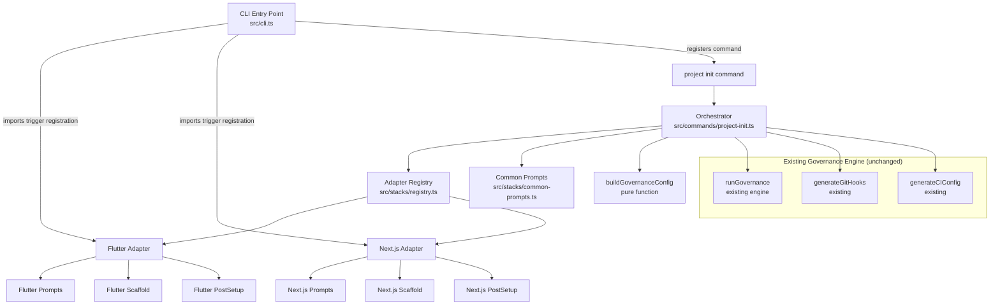
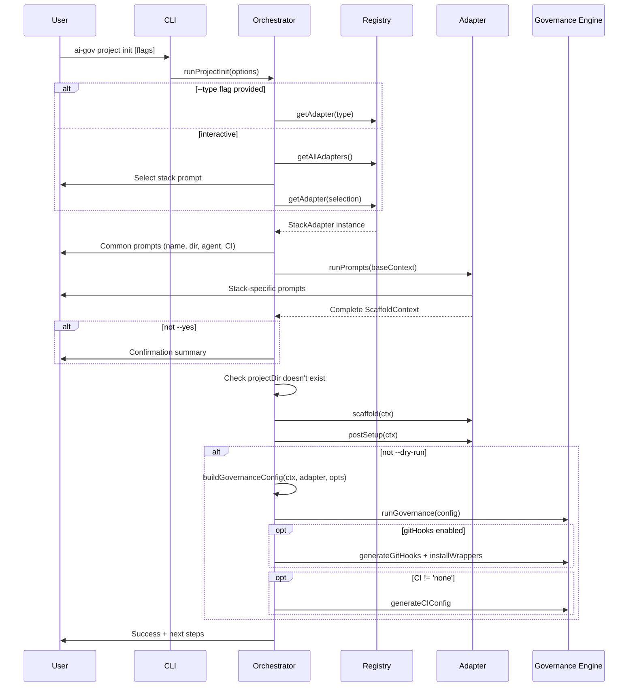
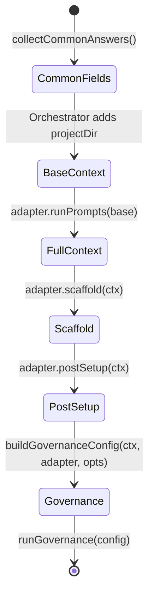

# Design Document: project-init

## Overview

The `ai-gov project init` command scaffolds new software projects with governance applied from day one. It implements an adapter pattern where stack-specific adapters (Flutter, Next.js) self-register into a central registry, and an orchestrator coordinates the full flow: interactive wizard → scaffolding → post-setup → governance application.

The system is designed for extensibility — adding a new stack requires only creating an adapter file that calls `registerAdapter()` on import. The orchestrator remains unchanged.

### Key Design Decisions

1. **Adapter pattern with self-registration** — Adapters register themselves as a module-load side effect, eliminating orchestrator modifications when adding stacks.
2. **Pure `buildGovernanceConfig` function** — Governance config construction is extracted as a pure, exported function for unit testability without I/O.
3. **Separation of scaffold vs postSetup** — `scaffold()` writes files only (no shell commands), `postSetup()` runs shell commands. This enables testing scaffold output without system dependencies.
4. **scanHints over filesystem scanning** — Newly created projects derive ScanResult from wizard answers rather than scanning the filesystem, since we already know the project structure.
5. **`conflictMode: 'keep'`** — All projects created via `project init` are protected from accidental governance overwrites by workspace-level commands.
6. **`@inquirer/prompts`** — ESM-native, modular prompt library replacing legacy inquirer.

## Architecture



### Orchestrator Flow



## Components and Interfaces

### StackAdapter Interface

```typescript
// src/stacks/adapter.ts

import type { Stack, Agent, ScanResult } from '../types.js';

export interface ScaffoldContext {
  // Common — always present (set by orchestrator)
  appName:     string;   // snake_case (flutter) or kebab-case (next)
  displayName: string;   // Human-readable, e.g. "AccuShield"
  outputDir:   string;   // Absolute path to parent directory
  projectDir:  string;   // outputDir + '/' + appName

  // Governance — always present
  agent:       Agent;
  gitHooks:    boolean;
  ci:          'github' | 'gitlab' | 'bitbucket' | 'none';

  // Stack-specific — each adapter adds its own keys
  [key: string]: unknown;
}

export interface StackAdapter {
  readonly id: Stack;
  readonly displayName: string;
  readonly nameHint: string;

  runPrompts(base: ScaffoldContext): Promise<ScaffoldContext>;
  scaffold(ctx: ScaffoldContext): Promise<void>;
  scanHints(ctx: ScaffoldContext): Partial<ScanResult>;
  postSetup(ctx: ScaffoldContext): Promise<void>;
}
```

### Adapter Registry

```typescript
// src/stacks/registry.ts

import type { StackAdapter } from './adapter.js';
import type { Stack } from '../types.js';

const _adapters: Map<Stack, StackAdapter> = new Map();

export function registerAdapter(adapter: StackAdapter): void;
export function getAdapter(id: Stack): StackAdapter;
export function getAllAdapters(): StackAdapter[];
export function getSupportedStackIds(): Stack[];
```

**Invariants:**
- `registerAdapter` throws `"Adapter already registered for stack: {id}"` on duplicate
- `getAdapter` throws `"No adapter registered for stack: {id}"` on miss
- `getAllAdapters()` returns adapters in registration order
- Registration order is deterministic (controlled by import order in cli.ts)

### Common Prompts

```typescript
// src/stacks/common-prompts.ts

import { input, confirm, select } from '@inquirer/prompts';
import type { Agent } from '../types.js';

export interface CommonAnswers {
  appName:     string;
  displayName: string;
  outputDir:   string;
  agent:       Agent;
  gitHooks:    boolean;
  ci:          'github' | 'gitlab' | 'bitbucket' | 'none';
}

export async function collectCommonAnswers(
  nameHint: string,
  nameValidator: (name: string) => string | true,
): Promise<CommonAnswers>;

export function toDisplayName(name: string): string;
```

### Orchestrator & buildGovernanceConfig

```typescript
// src/commands/project-init.ts

import type { ScaffoldContext, StackAdapter } from '../stacks/adapter.js';
import type { GovernanceConfig } from '../types.js';

export interface ProjectInitOptions {
  type?: string;
  name?: string;
  yes?: boolean;
  dryRun?: boolean;
  dir?: string;
}

export async function runProjectInit(options: ProjectInitOptions): Promise<void>;

export function buildGovernanceConfig(
  ctx: ScaffoldContext,
  adapter: StackAdapter,
  options: { dryRun?: boolean; overwrite?: boolean; updateHooks?: boolean },
): GovernanceConfig;
```

### Flutter Adapter

```typescript
// src/stacks/flutter/adapter.ts

export class FlutterAdapter implements StackAdapter {
  readonly id = 'flutter' as const;
  readonly displayName = 'Flutter';
  readonly nameHint = 'snake_case (e.g. my_app)';
}

// src/stacks/flutter/prompts.ts
export interface FlutterContext extends ScaffoldContext {
  androidPackage:  string;
  iosBundle:       string;
  flutterVersion:  string;
  services:        FlutterService[];
}

export interface FlutterService {
  name:      string;
  envUrls:   Record<'local' | 'dev' | 'qa' | 'staging' | 'prod', string>;
  headers:   Record<string, string>;
  endpoints: FlutterEndpoint[];
}

export interface FlutterEndpoint {
  method: string;
  path:   string;
}
```

### Next.js Adapter

```typescript
// src/stacks/next/adapter.ts

export class NextAdapter implements StackAdapter {
  readonly id = 'next' as const;
  readonly displayName = 'Next.js';
  readonly nameHint = 'kebab-case (e.g. my-app)';
}

// src/stacks/next/prompts.ts
export interface NextContext extends ScaffoldContext {
  projectType:    'frontend' | 'fullstack';
  packageManager: 'npm' | 'yarn' | 'pnpm' | 'bun';
  router:         'app' | 'pages';
  styling:        'tailwind' | 'css-modules' | 'styled-components';
  serverState:    'tanstack-query' | 'swr' | 'none';
  clientState:    'zustand' | 'redux-toolkit' | 'none';
  auth:           'nextauth' | 'clerk' | 'none';
  database:       'prisma' | 'drizzle' | 'none';
  apiStyle:       'rest' | 'trpc' | 'none';
}
```

## Data Models

### ScaffoldContext Lifecycle



### Type System Extension

```typescript
// src/types.ts — extended
export type Stack = 'flutter' | 'kotlin' | 'nodejs' | 'react' | 'next' | 'angular' | 'swiftui' | 'python' | 'java';
```

### Profile Extension

```typescript
// src/profiles.ts — new case in loadBaseProfile switch
case 'next': return { ...base, ...reactProfile(), ...nextProfileOverrides() };

function nextProfileOverrides(): Partial<BaseProfile> {
  return {
    stackDisplay: 'Next.js',
    buildCmd: 'npm run build',
    runCmd: 'npm run dev',
  };
}
```

### CLI Flags Model

| Flag | Type | Default | Validation |
|------|------|---------|------------|
| `--type <stack>` | string | (interactive) | Must be in `getSupportedStackIds()` |
| `--name <name>` | string | (interactive) | Max 214 chars, must match adapter's naming regex |
| `--yes` | boolean | false | — |
| `--dry-run` | boolean | false | — |
| `--dir <path>` | string | `process.cwd()` | Must exist and be a directory |

### Naming Validation Rules

| Stack | Regex | Example |
|-------|-------|---------|
| Flutter | `^[a-z][a-z0-9_]*$` | `accu_shield` |
| Next.js | `^[a-z][a-z0-9-]*$` | `accu-shield` |

### Endpoint Name Derivation Algorithm

```
Input:  method="GET", path="/users/{userId}/posts/{postId}"
Step 1: Strip leading slash → "users/{userId}/posts/{postId}"
Step 2: Remove parameterised segments → ["users", "posts"]
Step 3: Join in camelCase → "usersPosts"
Step 4: Append "ById" (since params existed) → "usersPostsById"
Step 5: Check for duplicates within same service → if duplicate, prefix with method: "getUsersPostsById"
```

### buildGovernanceConfig Algorithm

```
Input: ctx: ScaffoldContext, adapter: StackAdapter, options
Output: GovernanceConfig

1. stack     = adapter.id
2. profile   = loadBaseProfile(adapter.id)
3. scan      = { ...createDefaultScanResult(), ...adapter.scanHints(ctx) }
4. project   = { appName: ctx.displayName, packageName: ctx.appName, appDescription: '', ticketSystem: 'Jira', ticketPrefix: 'TICKET', legacyDescription: 'No legacy code' }
5. isBackend = (stack === 'nodejs' || stack === 'python' || (stack === 'java' && isJavaBackend(scan)))
6. blocks    = computeContentBlocks(stack, profile, scan)
7. Return GovernanceConfig with conflictMode='keep', all fields assembled
```

## Correctness Properties

*A property is a characteristic or behavior that should hold true across all valid executions of a system — essentially, a formal statement about what the system should do. Properties serve as the bridge between human-readable specifications and machine-verifiable correctness guarantees.*

### Property 1: Registry Lookup Invariant

*For any* StackAdapter instance registered via `registerAdapter(adapter)`, calling `getAdapter(adapter.id)` SHALL return that exact same instance, and `getAllAdapters()` SHALL include it, and `getSupportedStackIds()` SHALL include `adapter.id`.

**Validates: Requirements 1.3, 1.5, 1.6, 3.8**

### Property 2: Registry Error on Unknown Identifier

*For any* string value that is not present in the set of registered stack identifiers, calling `getAdapter(id)` SHALL throw an Error whose message contains the exact string that was attempted.

**Validates: Requirements 1.4**

### Property 3: Registry Preserves Registration Order

*For any* sequence of StackAdapter registrations, `getAllAdapters()` SHALL return adapters in the same order they were registered.

**Validates: Requirements 1.7**

### Property 4: Duplicate Registration Error

*For any* StackAdapter that has already been registered, calling `registerAdapter` again with an adapter having the same `id` SHALL throw an Error with message `"Adapter already registered for stack: {id}"`.

**Validates: Requirements 3.9**

### Property 5: Whitespace App Name Rejection

*For any* string composed entirely of whitespace characters (spaces, tabs, newlines), the app name validator SHALL reject it and return an error indication.

**Validates: Requirements 2.2**

### Property 6: Display Name Transformation

*For any* string containing hyphens or underscores, `toDisplayName` SHALL replace all hyphens and underscores with spaces and capitalize the first letter of each resulting word.

**Validates: Requirements 2.3**

### Property 7: runPrompts Preserves Base Context

*For any* ScaffoldContext passed to `adapter.runPrompts(base)`, the returned context SHALL contain all key-value pairs from the original base context unchanged (stack-specific fields are added, existing fields are not modified).

**Validates: Requirements 3.1**

### Property 8: Flutter Naming Convention Validation

*For any* string, the Flutter name validator SHALL accept it if and only if it matches the regex `^[a-z][a-z0-9_]*$`.

**Validates: Requirements 4.1**

### Property 9: Next.js Naming Convention Validation

*For any* string, the Next.js name validator SHALL accept it if and only if it matches the regex `^[a-z][a-z0-9-]*$`.

**Validates: Requirements 4.2**

### Property 10: Flutter Scaffold Directory Completeness

*For any* valid FlutterContext, after `scaffold(ctx)` completes, all required directories (lib/core/config/, lib/core/di/, lib/core/network/, lib/features/, assets/images/, bricks/clean_feature/__brick__/, test/architecture/) SHALL exist within `ctx.projectDir`.

**Validates: Requirements 5.1**

### Property 11: Flutter Endpoint Name Derivation

*For any* endpoint path, the derived constant name SHALL be produced by: stripping the leading slash, removing parameterised segments (those matching `{...}`), joining remaining segments in camelCase, appending a single "ById" suffix if any parameterised segments existed, and prefixing with the lowercase HTTP method if the resulting name duplicates another endpoint in the same service.

**Validates: Requirements 5.4, 5.5, 5.11**

### Property 12: Flutter AppConfig Getter-Per-Service

*For any* non-empty list of FlutterService objects in the context, the generated `app_config.dart` SHALL contain exactly one static getter per service, and each getter name SHALL be the camelCase transformation of the service name followed by "BaseUrl".

**Validates: Requirements 5.2**

### Property 13: Flutter pubspec.yaml Correctness

*For any* valid FlutterContext, the generated `pubspec.yaml` SHALL have its `name` field equal to `ctx.appName` and SHALL include `flutter_bloc`, `dio`, `get_it`, and `go_router` in its dependencies.

**Validates: Requirements 5.7**

### Property 14: Flutter Package Import Prefix

*For any* valid FlutterContext with appName `X`, all generated Dart files that contain import statements SHALL use the `package:X/` prefix for internal imports.

**Validates: Requirements 5.10**

### Property 15: Next.js Conditional Directory Structure

*For any* valid NextContext, when `projectType` is `'frontend'`, the directories `src/app/api/`, `src/lib/`, and `src/middleware.ts` SHALL NOT exist; when `projectType` is `'fullstack'`, they SHALL exist alongside all frontend directories.

**Validates: Requirements 9.1, 9.2, 9.3**

### Property 16: Next.js Conditional Dependency Inclusion

*For any* valid NextContext: (a) `next`, `react`, `react-dom`, `typescript`, `@types/react`, `@types/node`, and `zod` SHALL always be present in package.json; (b) `tailwindcss` SHALL be present iff `styling === 'tailwind'`; (c) `@tanstack/react-query` SHALL be present iff `serverState === 'tanstack-query'`; (d) `next-auth` SHALL be present iff `auth === 'nextauth'` AND `projectType === 'fullstack'`; (e) `prisma` and `@prisma/client` SHALL be present iff `database === 'prisma'` AND `projectType === 'fullstack'`; (f) auth and database dependencies SHALL NOT be present when `projectType === 'frontend'`.

**Validates: Requirements 9.4, 9.5, 9.6, 9.7, 9.8, 9.9, 9.10**

### Property 17: Next.js scanHints Derivation

*For any* valid NextContext, `scanHints(ctx)` SHALL return: `detectedSSR: true`, `detectedNextRouter` equal to `ctx.router`, `detectedRSC` equal to `ctx.router === 'app'`, `detectedCSSApproach` equal to `ctx.styling`, `detectedSubtype` as `'fullstack'` or `'frontend'` matching `ctx.projectType`, `detectedORM` as the database value or empty string for 'none', `detectedAuth` as the auth value or empty string for 'none', and `detectedPackageManager` equal to `ctx.packageManager`.

**Validates: Requirements 12.1, 12.2, 12.3, 12.4, 12.5, 12.6, 12.7, 12.8, 12.9**

### Property 18: buildGovernanceConfig Pure Function Correctness

*For any* valid ScaffoldContext and StackAdapter, `buildGovernanceConfig(ctx, adapter, opts)` SHALL return a GovernanceConfig where: `config.stack === adapter.id`, `config.agent === ctx.agent`, `config.projectDir === ctx.projectDir`, `config.project.appName === ctx.displayName`, `config.project.packageName === ctx.appName`, `config.conflictMode === 'keep'`, and `config.scan` equals the merge of `createDefaultScanResult()` with `adapter.scanHints(ctx)`.

**Validates: Requirements 14.1, 19.1, 19.3, 19.4, 19.5, 19.6, 19.7, 19.8, 19.9, 19.10**

## Error Handling

### Error Categories

| Error | Source | Behavior |
|-------|--------|----------|
| Unknown stack identifier | Registry / CLI --type flag | Throw with message listing valid stacks, abort |
| Duplicate adapter registration | Registry | Throw at module load time (developer error) |
| Invalid app name (interactive) | Common prompts | Re-prompt with error message showing required format |
| Invalid app name (--name flag) | CLI validation | Print error, abort without prompting |
| Invalid --dir path | CLI validation | Print error, abort without prompting |
| Project directory already exists | Orchestrator step 7 | Print error with conflicting path, abort |
| scaffold() failure | Adapter | Print error indicating scaffold failed, abort remaining steps |
| postSetup() command failure (Flutter) | FlutterAdapter | Print warning for FVM/pub get failures, continue to next steps |
| postSetup() command failure (Next.js) | NextAdapter | Print error indicating which command failed, abort remaining steps |
| Governance engine failure | runGovernance | Print error, abort |
| Adapter import failure | CLI startup | Log warning, continue with remaining adapters |

### Error Propagation Strategy

- **Fail-fast for user errors**: Invalid flags, missing directories, and naming violations abort immediately with a clear message.
- **Warn-and-continue for optional tools**: FVM not installed → warning + skip FVM steps. This prevents hard failures on systems without optional tooling.
- **Abort on critical failures**: scaffold, postSetup (Next.js), and governance failures stop the pipeline to avoid partial/broken project state.

## Testing Strategy

### Dual Testing Approach

**Unit tests** verify specific examples, edge cases, and integration points:
- CLI flag parsing and validation
- Prompt sequence and defaults (mocked @inquirer/prompts)
- PostSetup command execution order (mocked child_process)
- File content verification (real temp directories)
- Error scenarios (existing directory, invalid names, failed commands)

**Property-based tests** verify universal properties across generated inputs:
- Registry invariants (lookup, order, errors)
- Naming validation (regex equivalence)
- Scaffold output completeness (directory structure)
- Endpoint name derivation (transformation rules)
- Dependency inclusion rules (conditional logic)
- buildGovernanceConfig field mapping
- scanHints derivation

### Property-Based Testing Configuration

- **Library**: `fast-check` (TypeScript-native, ESM-compatible)
- **Minimum iterations**: 100 per property test
- **Tag format**: `Feature: project-init, Property {N}: {title}`

### Test File Structure

```
tests/
  project-init.test.ts              ← Orchestrator + registry + buildGovernanceConfig
  stacks/
    flutter-adapter.test.ts         ← Flutter scaffold, scanHints, naming
    flutter-adapter.property.test.ts ← Property tests for Flutter
    next-adapter.test.ts            ← Next.js scaffold, scanHints, naming
    next-adapter.property.test.ts   ← Property tests for Next.js
    registry.property.test.ts       ← Registry property tests
    common-prompts.property.test.ts ← Naming/display name property tests
```

### Key Test Scenarios (Example-Based)

| Scenario | What's Verified |
|----------|----------------|
| Flutter scaffold with 2 services | AppConfig has 2 getters, correct URLs per environment |
| Flutter scaffold with no services | Default api + node services generated |
| Flutter endpoint `/users/{id}` | Constant named `usersById` |
| Flutter duplicate endpoints | Method prefix disambiguation |
| Next.js frontend scaffold | No api/, lib/, middleware.ts |
| Next.js fullstack + prisma | prisma deps included, health route exists |
| Next.js frontend + prisma setting | prisma deps excluded (frontend override) |
| buildGovernanceConfig with DummyAdapter | All field mappings correct |
| --type invalid | Error lists valid stacks |
| --name "INVALID" for flutter | Error shows snake_case requirement |
| Existing projectDir | Abort with path in error message |
| --dry-run | scaffold + postSetup run, governance skipped |

### Integration Test Strategy

- Use real temp directories (`mkdtempSync`) for scaffold output verification
- Mock `@inquirer/prompts` for prompt flow tests
- Mock `child_process.execSync` for postSetup command verification
- DummyAdapter (test-only, not shipped) for orchestrator integration tests
